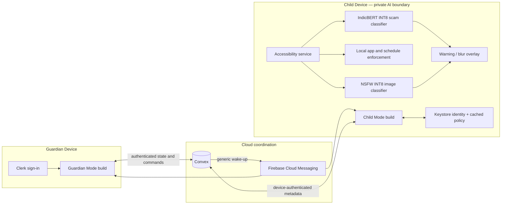
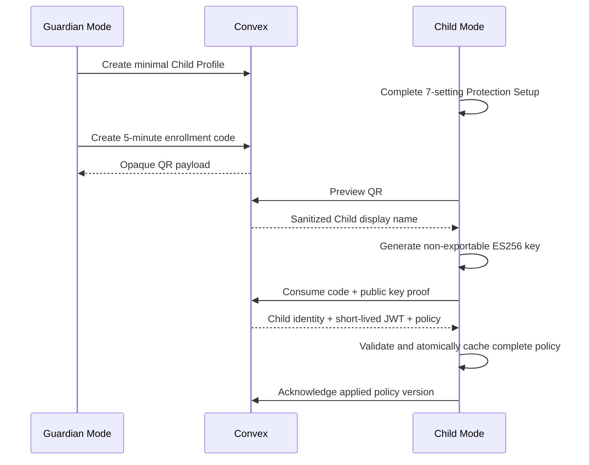
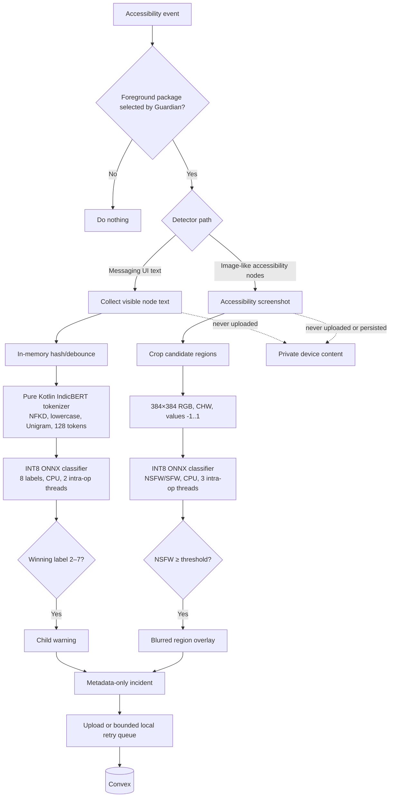
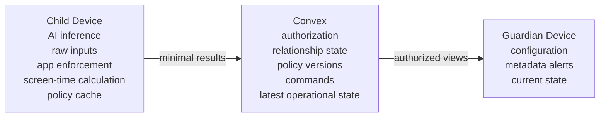

# Cereveil Architecture

This document describes the submission state of the `main` branch.

## System diagram



FCM is not authoritative and carries no policy body or captured content. After any push, the app reconciles with Convex. Delayed, repeated, reordered, or missed pushes therefore do not change the source of truth.

## Android components

The Gradle `role` product flavor creates two independently installable fixed-role builds of the Cereveil App from the same shell:

```text
app
├── src/main       shared application, navigation and UI foundation
├── src/guardian   Clerk auth, profiles, policy, map, alerts and enrollment QR
└── src/child      enrollment, device auth, protection and background work

core/domain        shared domain boundary
core/network       shared network boundary
feature/guardian   Guardian feature boundary
feature/child      Child feature boundary
feature/child/ml   ONNX Runtime classifiers and packaged model assets
convex             schema, HTTP routes, queries, mutations, actions and crons
```

Guardian Mode authenticates a person through Clerk. Child Mode has no Child login: enrollment creates an ES256 key in Android Keystore, and the backend issues a 15-minute device JWT after challenge signing.

## Enrollment and policy data flow



Only a SHA-256 hash of the enrollment token is stored in Convex. Desired/applied versions make partial policy application visible. The Child Device continues enforcing its last accepted policy while offline.

## Local model pipeline



Scam sensitivity currently does not alter the winning-label rule. NSFW thresholds are `0.60` (Lower), `0.40` (Standard), and `0.10` (Higher). The blur pipeline tracks live accessibility bounds and removes overlays when content disappears or revalidates safe.

## Operational data flows

| Feature | Child-side work | Cloud data |
|---|---|---|
| App blocking | Accessibility service evaluates cached rules and local access grants | Complete versioned policy, request/grant state, acknowledgements |
| Location | Android LocationManager measures on device | Latest latitude, longitude, accuracy and capture time; previous latest row is overwritten |
| Screen time | Usage events are aggregated from local day start | Requested snapshot of package, label and duration; no raw usage events |
| Safety | Text/image inference and intervention on device | Detector type, package, time, confidence band, incident/policy IDs |
| Remote audio | Microphone capture and WebRTC media on devices | Request state and expiring WebRTC signaling only; no audio recording |
| Push | Device obtains an FCM token | Encrypted token and delivery bookkeeping; notification body is generic |

## Local and cloud responsibility



Internet is required for Guardian authentication, enrollment, policy synchronization, alert delivery, access decisions, current-state refreshes, and remote-audio coordination. Cached app blocking and already configured Local AI inference can continue without it; metadata uploads retry later.

## Key design decisions

- Two role-specific packages prevent accidental role switching and allow separate permission surfaces.
- Raw AI inputs stay on the Child Device; reduced alert metadata is the only incident data crossing the boundary.
- Convex is authoritative; FCM only wakes clients.
- Complete versioned policies are applied atomically and retained for offline enforcement.
- Child credentials use Keystore proof-of-possession rather than a reusable Child password.
- Monitoring is opt-in per app; newly installed apps are not silently added.
- Location and screen time are latest/on-demand states rather than behavioral histories.
- Remote audio is disclosed, stoppable by the Child, never recorded, and uses STUN-only WebRTC.
- Active Screen Safety remains debug-only until accessibility screenshot distribution compliance is resolved.

Detailed decisions are recorded under [`docs/adr`](docs/adr).

Current implementation deviations from the intended architecture are recorded explicitly in [EVALUATION.md](EVALUATION.md#current-adr-deviations).
