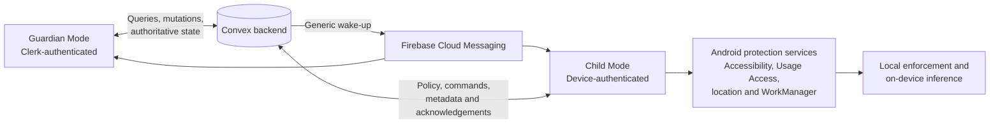
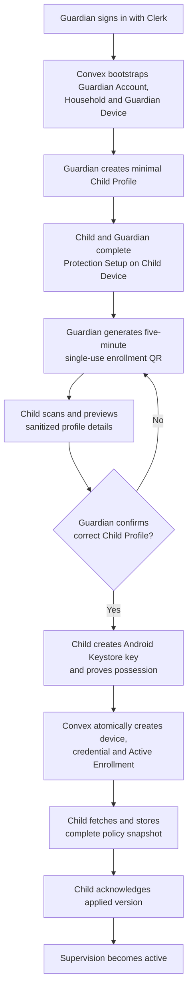
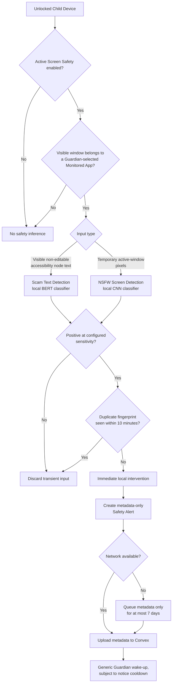
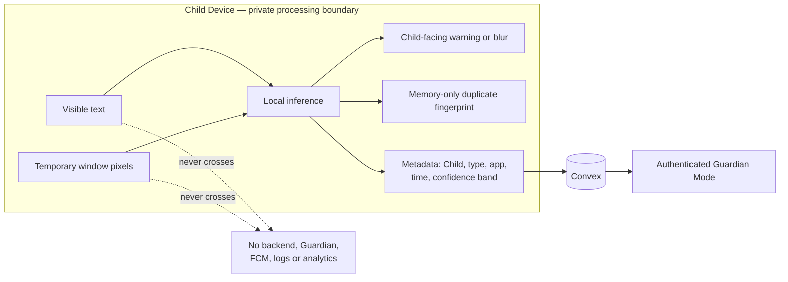

# Cereveil

> A privacy-first Android family-safety system that helps a Guardian supervise a Child Device with the Child's awareness.

> **Install the demo:** Download the ready-to-install Guardian Mode and Child Mode APKs from the [latest GitHub Release](https://github.com/Kapish14/Cereveil/releases/latest). Install Guardian Mode first, then Child Mode.

Cereveil is a single Android product with two roles: **Guardian Mode** configures protection and reviews current safety state, while **Child Mode** transparently applies that protection on the enrolled phone. The project combines local Android enforcement, a Convex backend, short-lived device identity, and a deliberately narrow on-device AI design.

The product is built around one promise: **sensitive content used for AI safety detection stays on the Child Device**. Visible accessibility text and temporary active-window pixels are classified locally. Raw text, screenshots, OCR, screen recordings, and captured pixels are not uploaded to Convex or exposed to the Guardian.

## Contents

- [What Cereveil does](#what-cereveil-does)
- [How it works](#how-it-works)
- [On-device AI](#on-device-ai)
- [Tech stack](#tech-stack)
- [Repository structure](#repository-structure)
- [Local setup](#local-setup)
- [Build and run](#build-and-run)
- [Using the app](#using-the-app)
- [Testing](#testing)
- [Privacy and security](#privacy-and-security)
- [Architecture documentation](#architecture-documentation)

## What Cereveil does

Cereveil is designed for a Guardian supervising one or more children aged 8–15. Each Child Profile has at most one active Child Device, and the Guardian Account can be used from at most two active Guardian Devices.

The main product capabilities are:

- **Visible supervision** — Child Mode remains identifiable and explains when protection is active.
- **Guided enrollment** — a Guardian creates a minimal Child Profile, completes protection setup with the Child, and pairs the phone using a five-minute, single-use QR code.
- **App controls** — Guardian-selected manual and scheduled blocks are evaluated on the Child Device. A blocked Child can request temporary access.
- **Policy-based operation** — versioned, complete policy snapshots are applied atomically, acknowledged by Child Mode, and remain enforceable offline.
- **Latest location** — the Guardian sees the latest permitted measurement rather than a location history, and can request one fresh measurement.
- **Current-day screen time** — the Guardian can request Android-calculated, today-so-far per-app totals; raw usage events and history are not uploaded.
- **On-device AI safety** — Active Screen Safety locally detects visible scam text and NSFW screen content in explicitly selected apps.
- **Privacy-safe notifications** — Firebase Cloud Messaging (FCM) wakes clients, while Convex remains authoritative. Push payloads do not carry policy bodies or sensitive incident details.

## How it works

### System overview



Convex owns the authoritative supervision relationship, policies, commands, notification state, latest-only data, and lifecycle rules. FCM is only a best-effort wake-up channel; both Android roles reconcile with Convex after delayed, duplicated, reordered, or missed pushes.

### Enrollment and policy flow



Enrollment Codes are stored only as SHA-256 hashes in Convex. After enrollment, Child Mode uses a non-exportable Android Keystore key to obtain 15-minute Child Device JWTs through challenge signing; the enrollment code is not a reusable login credential.

## On-device AI

### Why inference stays on the phone

Children's messages and screens can contain exceptionally sensitive information. Sending that content to a server would turn a safety feature into a content-collection system. Cereveil therefore defines the Child Device as the hard boundary for safety inference:

- raw accessibility text stays in memory on the Child Device;
- active-window screenshots are temporary inference inputs;
- no OCR text, screenshots, screen recordings, or captured pixels are uploaded;
- the Guardian never receives raw detected content;
- backend logs, analytics, crash reports, and support data must not contain captured content;
- model limitations are accepted instead of adding server-side reprocessing.

### Active Screen Safety pipeline

Active Screen Safety is one policy-controlled feature containing both detectors. A Guardian must explicitly choose one or more **Monitored Apps**. Cereveil does not automatically monitor newly installed or suggested apps.



### Detector behavior

| Concern | Scam Text Detection | NSFW Screen Detection |
|---|---|---|
| Input | Visible, non-editable accessibility node text | Temporary screenshot of the active Monitored App window |
| Model | On-device BERT classifier | On-device CNN classifier |
| Excluded input | Editable drafts, OCR, notifications, unopened/background content | Gallery scans, locked/off-screen content, system bars, keyboards, overlays, other apps |
| Child response | Dismissible Safety Warning, automatically removed after 15 seconds | Non-dismissible blur confined to detected content; no extra dialog, banner, or toast |
| Guardian data | Detection type, app, timestamp, coarse confidence band | Detection type, app, timestamp, coarse confidence band |
| Raw content uploaded? | Never | Never |

In split-screen and picture-in-picture, capture, classification, and blur must remain confined to the Monitored App's region. When usable image nodes are unavailable for video, canvas, or custom rendering, the design permits classifying the Monitored App window only—not the whole display.

### Data boundary



### Incident lifecycle

- A novel positive result creates one local Safety Intervention and one metadata-only Safety Alert.
- A memory-only fingerprint suppresses repeated inference of the same visible item for ten minutes.
- Fingerprints are cleared on process death, restart, Active Screen Safety disablement, and End Supervision. They are never uploaded or persisted.
- Scam and NSFW Guardian Notices have separate, fixed two-minute cooldowns. The cooldown limits immediate notifications, not Child interventions or stored novel alerts.
- Offline Child Mode may queue only idempotent metadata, for no more than seven days.
- A delayed alert produces an immediate Guardian Notice only if it reaches Convex within five minutes of detection and the cooldown permits it.
- Individual metadata-only Safety Alerts expire after one week. Cereveil does not generate weekly or aggregate incident summaries.

### Device requirements and detection behavior

- The app supports Android 8 / API 26 and newer, but **Active Screen Safety requires Android 11 / API 30+** because NSFW capture uses the accessibility screenshot API introduced in Android 11.
- The two detectors are enabled atomically. An older Child Device cannot silently run Scam Text Detection without NSFW Screen Detection.
- Accessibility APIs expose only what the active app makes available; inaccessible, image-based, hidden, muted, or unopened scam content will not be detected.
- Local models constrain accuracy, memory, latency, and battery use. Sensitivity is exposed as `Lower`, `Standard`, or `Higher`, not as raw model thresholds.
- AI safety output is an assistive signal, not proof of intent or a substitute for conversation, judgment, or emergency services.

The governing decisions are [ADR-0010](docs/adr/0010-limit-scam-detection-to-selected-active-apps.md), [ADR-0011](docs/adr/0011-detect-nsfw-content-from-active-window-screenshots.md), [ADR-0019](docs/adr/0019-intervene-for-the-child-and-alert-the-guardian-together.md), [ADR-0020](docs/adr/0020-keep-safety-alerts-metadata-only.md), [ADR-0036](docs/adr/0036-run-safety-detection-on-device-only.md), [ADR-0056](docs/adr/0056-create-safety-alerts-from-on-device-incidents.md), and [ADR-0086](docs/adr/0086-require-android-11-for-active-screen-safety.md).

## Tech stack

| Layer | Technology |
|---|---|
| Android | Kotlin, Android Gradle Plugin, JDK 17, min SDK 26, compile/target SDK 36 |
| UI | Jetpack Compose, Material 3, Composables UI, Navigation 3 |
| Android architecture | Product flavors for Guardian/Child roles, ViewModels, coroutines/Flow, WorkManager |
| Backend | Convex with TypeScript functions, schema validation, scheduled jobs, and HTTP actions |
| Guardian auth | Clerk Android SDK with Convex JWT integration |
| Child auth | Android Keystore proof-of-possession and Cereveil-issued 15-minute JWTs |
| Push | Firebase Cloud Messaging using minimal data wake-ups |
| Maps | Google Maps SDK for Android with a `geo:` fallback |
| Enrollment | Google Code Scanner in Child Mode and ZXing QR generation in Guardian Mode |
| Backend tests | Vitest, `convex-test`, TypeScript |
| Android tests | JUnit, Compose UI testing, AndroidX Test, Espresso |
| On-device AI | Local BERT scam-text classification and local CNN NSFW classification |

## Repository structure

```text
Cereveil/
├── app/                    # Android application and Guardian/Child product flavors
│   └── src/
│       ├── main/           # Shared application, navigation, theme, and UI
│       ├── guardian/       # Guardian auth, profiles, policy, enrollment, and live features
│       └── child/          # Child enrollment, capabilities, enforcement, and background work
├── core/
│   ├── domain/             # Shared domain-facing Android module
│   └── network/            # Shared Convex/network Android module
├── feature/
│   ├── guardian/           # Guardian feature module boundary
│   └── child/              # Child feature module boundary
├── convex/
│   ├── modules/            # Domain-oriented backend modules
│   ├── lib/                # Auth, authorization, wrappers, errors, and sensitive-data helpers
│   ├── schema.ts           # Convex tables, validators, and indexes
│   ├── http.ts             # Child Device identity and command HTTP routes
│   └── crons.ts            # Cleanup and lifecycle schedules
├── tests/                  # Backend integration tests
├── docs/
│   ├── adr/                # Architectural decision records
│   ├── architecture/       # Android/backend structure and data model
│   ├── design/             # Visual and interaction design system
│   └── agents/             # Repository workflow documentation
├── CONTEXT.md              # Canonical domain vocabulary
└── package.json            # Convex, build, and verification scripts
```

The Android project separates the application shell, shared domain/network code, and role-specific Guardian and Child features. See [android-structure.md](docs/architecture/android-structure.md) for module boundaries and dependency rules.

## Local setup

### Prerequisites

- Android Studio with Android SDK 36 and build tools installed
- JDK 17 (the Gradle toolchain is configured for Java 17)
- Node.js and npm compatible with the checked-in `package-lock.json`
- A Convex account/project
- A Clerk application configured with a JWT template/audience for Convex
- Two Firebase Android app registrations, one for each role-specific package:
  - `com.cereveil.guardian.dev`
  - `com.cereveil.child.dev`
- Two Android devices or emulators for the full flow; Google Play services are required for QR scanning and FCM
- Android 11+ on the Child Device for Active Screen Safety

### 1. Install dependencies

```bash
git clone <repository-url>
cd Cereveil
npm ci
./gradlew --version
```

Opening the root directory in Android Studio will also synchronize the Gradle project.

### 2. Configure Convex

Connect the checkout to a Convex deployment:

```bash
npx convex dev
```

The backend declares these environment variables in `convex/convex.config.ts`:

| Variable | Required | Purpose |
|---|---:|---|
| `CLERK_JWT_ISSUER_DOMAIN` | Yes | Validates Clerk-issued Guardian tokens |
| `CHILD_DEVICE_JWT_SECRET` | Yes | HMAC secret for short-lived Child Device JWTs; minimum 32 characters |
| `CHILD_PUSH_TOKEN_ENCRYPTION_SECRET` | Yes | Legacy/fallback token encryption secret; minimum 32 characters |
| `FCM_TOKEN_ENCRYPTION_KEY_V1` | For FCM | Active AES-GCM key material; minimum 32 characters |
| `FCM_TOKEN_ENCRYPTION_ACTIVE_VERSION` | For FCM | Set to `1` for the v1 encrypted-token format |
| `FCM_PROJECT_ID` | For FCM | Firebase/Google Cloud project ID |
| `FCM_CLIENT_EMAIL` | For FCM | Service-account client email used by the backend |
| `FCM_PRIVATE_KEY` | For FCM | Service-account private key used to call FCM HTTP v1 |

Set values through the Convex CLI or deployment dashboard; never commit them. For example:

```bash
npx convex env set CLERK_JWT_ISSUER_DOMAIN 'https://<your-clerk-domain>'
npx convex env set CHILD_DEVICE_JWT_SECRET '<random-secret-at-least-32-characters>'
npx convex env set CHILD_PUSH_TOKEN_ENCRYPTION_SECRET '<different-random-secret-at-least-32-characters>'
npx convex env set FCM_TOKEN_ENCRYPTION_KEY_V1 '<different-random-secret-at-least-32-characters>'
npx convex env set FCM_TOKEN_ENCRYPTION_ACTIVE_VERSION '1'
```

Then run the backend in watch mode:

```bash
npm run convex:dev
```

### 3. Configure the Android builds

Create an ignored `.env.local` file at the repository root:

```properties
CONVEX_URL=https://<deployment-name>.convex.cloud
CONVEX_SITE_URL=https://<deployment-name>.convex.site
CLERK_PUBLISHABLE_KEY=pk_test_...

FIREBASE_GUARDIAN_APPLICATION_ID=1:...:android:...
FIREBASE_CHILD_APPLICATION_ID=1:...:android:...
FIREBASE_API_KEY=...
FIREBASE_PROJECT_ID=...
FIREBASE_GCM_SENDER_ID=...

GOOGLE_MAPS_API_KEY=...
```

`CONVEX_URL` is used by the Convex Android client; `CONVEX_SITE_URL` is used by the Child Device identity HTTP endpoints. The Guardian build requires `CLERK_PUBLISHABLE_KEY` at startup. Firebase values enable push registration; the Maps key is Guardian-only.

The project initializes Firebase from these build-time values, so `google-services.json` is not required by the Gradle configuration.

For Maps, create a key restricted to the Guardian package and your debug signing certificate. Follow [development-google-maps.md](docs/development-google-maps.md); do not use an unrestricted key.

### 4. Configure Firebase delivery

Create a narrowly scoped service account for FCM HTTP v1 and set its values only in the Convex deployment:

```bash
npx convex env set FCM_PROJECT_ID '<firebase-project-id>'
npx convex env set FCM_CLIENT_EMAIL '<service-account-email>'
npx convex env set FCM_PRIVATE_KEY '<service-account-private-key>'
```

Do not put service-account credentials in `.env.local`, an APK, logs, tests, or documentation. The Android Firebase API key and application IDs are client configuration; the service-account private key is a backend secret.

## Build and run

### Build both role-specific APKs

```bash
npm run android:assemble
```

Equivalent Gradle command:

```bash
./gradlew :app:assembleGuardianDebug :app:assembleChildDebug
```

Outputs are written below:

```text
app/build/outputs/apk/guardian/debug/
app/build/outputs/apk/child/debug/
```

The role-specific package IDs differ, so both roles can be installed side by side for a compact demo. For the complete Guardian–Child experience, use two physical Android devices.

### Install from the command line

With a target device connected:

```bash
adb devices
./gradlew :app:installGuardianDebug
./gradlew :app:installChildDebug
```

If two devices are attached, install the appropriate APK with `adb -s <serial> install -r <apk-path>`.

### Run in Android Studio

Select either the `guardianDebug` or `childDebug` build variant, choose the appropriate device, and run the `app` configuration.

## Using the app

### Guardian Mode

1. Launch **Cereveil Guardian** and sign in through Clerk.
2. Read and accept the transparency/privacy introduction.
3. Create a Child Profile using a display name and birth month/year. Cereveil does not require a legal name, exact birth date, email, phone number, or Child login.
4. Choose **Set up Child Device** to create a five-minute enrollment QR code.
5. Keep the code beside the Child Device; do not send or save a screenshot of it.
6. After enrollment, configure supervision controls and use the Child Profile surfaces for app access, latest location, and current-day screen time.
7. Wait for Child Mode to acknowledge a new policy before treating it as applied. Offline Child Mode continues enforcing its last accepted policy.

### Child Mode

1. Launch **Cereveil Child** with the Child and Guardian present.
2. Complete the seven-step Protection Setup:
   - Accessibility
   - Usage Access
   - precise location and microphone
   - background location
   - notifications
   - battery-optimization exemption
   - automatic date, time, and time zone
3. Select **Check settings and continue**. Child Mode cannot scan an enrollment code until required capabilities are ready.
4. Scan the QR shown in Guardian Mode.
5. Verify the sanitized Child Profile preview, then confirm enrollment.
6. Child Mode creates device-specific key material, completes enrollment, fetches the initial policy, and reports when protection is applied.

## Testing

Run all backend tests:

```bash
npm test
```

Run TypeScript validation:

```bash
npm run typecheck
```

Compile both Android variants:

```bash
npm run android:compile
```

Run Android unit tests:

```bash
./gradlew testGuardianDebugUnitTest testChildDebugUnitTest
```

Run connected instrumentation tests with a device/emulator available:

```bash
./gradlew connectedGuardianDebugAndroidTest connectedChildDebugAndroidTest
```

End-to-end behavior depends on Android capabilities, two authenticated roles, network transitions, and FCM delivery. Use the repository's manual guides:

- [Enforcement, location, and screen-time smoke test](docs/enforcement-location-screen-time-smoke-test.md)
- [Development FCM smoke test](docs/development-fcm-smoke-test.md)
- [Google Maps development setup](docs/development-google-maps.md)

When recording test results, never capture Child identity, coordinates, installed-app lists, per-app totals, tokens, policy bodies, private keys, or authorization headers.

## Privacy and security

Cereveil's architecture follows data minimization and explicit lifecycle rules:

- Child Profiles use minimal identity data and do not require contact information or an exact birth date.
- Every Convex operation is authenticated and authorized by actor and owned resource; authentication alone is not treated as authorization.
- Guardian and Child identities are separate. Clerk credentials do not leak into Child Mode, and Child Device credentials do not grant Guardian authority.
- Child Device credentials are independently revocable and bound to one Active Enrollment.
- FCM tokens are delivery endpoints, not identities, and are encrypted at rest by the application layer.
- Push messages contain generic categories and opaque record IDs; clients fetch authoritative content after authentication.
- Only the latest location is stored. Location history is not retained.
- Screen time contains current-day Android totals, not raw events, exact open/close times, or historical timelines.
- Safety Alerts are metadata-only and expire after one week; no aggregate incident summaries are generated.
- End Supervision revokes device access and removes Child-specific backend and local operational state.
- Logs and diagnostics must exclude raw screen/text/audio content, exact location history, notification bodies, and sensitive credentials.

## Architecture documentation

Start with these documents when changing behavior:

- [CONTEXT.md](CONTEXT.md) — canonical product language and domain definitions
- [Android structure](docs/architecture/android-structure.md) — module boundaries and Android architecture
- [Backend structure](docs/architecture/backend-structure.md) — Convex wrappers and feature-module conventions
- [Backend data model](docs/architecture/backend-data-model.md) — table shapes, ownership, retention, and lifecycle rules
- [Design system](docs/design/DESIGN.md) — the calm-shelter visual language, accessibility, and trust constraints
- [Architecture decisions](docs/adr/) — the source of truth for product and engineering trade-offs

When working on Convex code, read `convex/_generated/ai/guidelines.md` before making changes; its generated Convex API guidance overrides general assumptions about Convex patterns.

## License

Licensed under the [Apache License 2.0](LICENSE).
